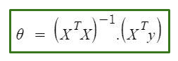

# Multivariate-Linear-Regression

## Repository contains the following files :
* found.txt : data of impact factors of journals.
* data_journals.csv : data of journals (downloaded from [here](https://www.scimagojr.com/journalrank.php?area=1700&type=j)). 
* Main.py : Main script file written in Python3 to extract,clean, analyse data.
* Answers.txt : Answers obtained by running the script file.

## Abstract of the Project
* The model finds the best possible linear regression for the given data using multivariate regression.
* Data obtained after cleaning and extraction contains 591 data points with Nine Features(Enlisted below) that should be considered for predicting the linear regression.
* Features : 
  * 'SJR'
  * 'H index'
  * 'Total Docs. (2017)'
  * 'Total Docs. (3years)'
  * 'Total Refs.'
  * 'Total Cites (3years)'
  * 'Citable Docs. (3years)'
  * 'Cites / Doc. (2years)'
  * 'Ref. / Doc.'
* Script file contains all the necessary functions, computations necessary for multivariate regression. It appends the answers after all the necessary computations to “Answers.txt”, after being executed once in Python3.
* “Answers.txt” file currently contains  5-5 best combinations for obtaining Minimum mean absolute error and Minimum mean absolute error.

## Multivariate Regression :
* I have used all possible combination of features in order to predict the best combination which gives the minimum error.
* All possible Combinations of Features Required:(2^9) - 1 - 9 = 502
  * (-1) for selecting no feature.
  * (-9) for selecting only one of the nine feature as for linear regression we need at least 2 features. (This is my assumption)
* Normal equation method for multivariate-regression.
* Formula Used : 

## Dependencies:
* Numpy Module : For computing matrix computations
* Pandas Module : For extracting and cleaning data.
* Python3

